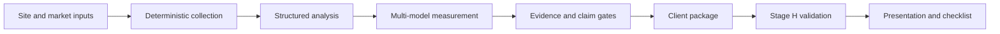

# AIVS - evidence-backed AI visibility auditing

AIVS is a private, commercial eight-stage system that measures how AI services represent a business and turns those observations into validated implementation work.

## Production example

The [public sample](sample/README.md) is derived from a real production audit completed on 26 June 2026.

> Sanitized from a real production audit. Identifying business information and competitor names were removed; retained numeric engineering metrics are unchanged unless explicitly noted.

| Run fact | Result |
|---|---|
| Measurement | 27 Dutch queries × 4 models |
| Providers | OpenAI, Google, Anthropic, Perplexity |
| Completion | 108 / 108 valid responses, 100% |
| Mode | `strict_production` |
| Visibility | 37.0% (stored interval 22.2%-55.6%) |
| Recommendation | 37.0% (stored interval 22.2%-55.6%) |
| Link rate | 29.6% (stored interval 14.8%-44.4%) |
| Claim control | 58 verified facts, 22 supported interpretations, 5 hypotheses, 0 unsupported, 0 forbidden |
| Stage H | final artifacts emitted; presentation passed 0/0, checklist passed 0 errors/3 warnings |

These values describe one audit-time model sample. They are evidence about the observed answer set, not customer, revenue or ranking forecasts.

## System flow

The implementation has eight stages with explicit contracts and validation gates. Deterministic processing establishes source facts and metrics; LLM components work within structured inputs and outputs. Claim classification distinguishes verified facts, supported interpretations and hypotheses, and blocks unsupported or forbidden wording from the selected delivery.

See [architecture](ARCHITECTURE.md) for responsibility boundaries and [provenance](PROVENANCE.md) for the source-to-public hash chain.

## Measurement and reporting

The selected run used Dutch as its only measured language. The product supports client report output in six languages: Russian, English, Finnish, German, Dutch and French. Output-language support does not mean every language was measured in this audit.

The saved Stage H run produced validated Dutch and Russian HTML. Its original PDF outputs were skipped. The public sample includes newly rendered, sanitized PDF derivatives plus their HTML sources and SHA-256 manifest.

## Attestation boundary

The source package contains an Ed25519 attestation and its canonical package digest recomputes to the value referenced by both Stage H manifests. The signing public key was unavailable, so the signature was not independently verified and Stage H records `signed: false` and `attestation_verified: false`. Attestation presence and verification are stated separately throughout this case study.

## Test evidence

At private commit `3809ab6ca006d397d58d65d3ea32927a3e0160e1`, pytest collected 4,320 tests. The unrestricted local run on 7 September 2026 completed with **4,308 passed, 12 skipped, 0 failed and 0 errors** in 105.34 seconds. See [testing](TESTING.md).

## Public evidence

- [Sanitized report package](sample/README.md)
- [Provenance and run selection](PROVENANCE.md)
- [Testing record](TESTING.md)
- [Security and traceability](SECURITY_AND_TRACEABILITY.md)
- [Known evidence gaps](FOLLOW_UP.md)

Private source code, client inputs, prompts, credentials, signing keys, model response text and commercial decision rules remain private. This directory is an engineering case study, not a runnable distribution of the commercial system.

## License

No license has been selected for this material. No license to the private implementation is granted here.
