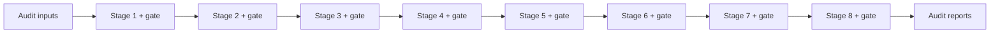

# AIVS — evidence-backed AI visibility auditing

An automated audit system combining deterministic extraction and LLM reasoning in an eight-stage pipeline with gated validation and traceable reporting.

## Problem

AI visibility audits need a repeatable way to turn source material into findings while preventing claims that lack measurable support. The engineering task is to control the path from extraction to reasoning and reporting.

## System overview

I built AIVS as an eight-stage system. Each stage has specifications, gates and checks. Deterministic extraction handles factual processing; LLM reasoning operates alongside it. Guardrails block claims without measurable foundations.

This case study describes the **commercial, private AIVS system** using facts explicitly confirmed by its owner. The separate public Declarative Business JSON-LD repository is a different implementation and does not establish the commercial system's test count, signing implementation or paid use.

## Eight-stage pipeline

This diagram shows the confirmed stage count and validation pattern. Numbers are conceptual positions, not disclosed internal stage names. Stage names, specific responsibilities and gate criteria are intentionally omitted until an approved public specification is available.

See [architecture](ARCHITECTURE.md) for responsibility boundaries.

## Deterministic vs LLM responsibilities

| Responsibility | Confirmed approach |
|---|---|
| Extraction | Deterministic processing |
| Reasoning | LLM reasoning combined with extracted evidence |
| Validation | Specifications, gates and checks at every stage |
| Claim control | Guardrails block unsupported claims |
| Reporting | Six languages supported |
| Attestation | Ed25519 for reports |

## Validation gates and guardrails

Checks exist at every stage, and claim guardrails require measurable foundations. This describes the confirmed control structure; it does not assert unpublished thresholds, retry policies or a specific schema implementation.

## Traceability and Ed25519 attestation

Evidence requirements constrain report claims. Ed25519 is used for report attestation. A signature can establish integrity and origin relative to a trusted key; it does not establish the factual correctness of an audit. The signed payload format and verification procedure are not public here. See [security and traceability](SECURITY_AND_TRACEABILITY.md).

## Testing: 4300+

The commercial system has **4300+ automated tests**, as confirmed by the owner. This is not a count from the public mapping repository or a test run performed for this portfolio. Coverage percentages and detailed test categories have not been published. See [testing](TESTING.md).

## Six-language report generation

AIVS generates reports in six languages. The language list and translation validation method have not been supplied for this public case study.

## Real-world use

The system has been used for real paid audits. Client names, revenue, audit volume and performance improvements are not disclosed or inferred.

## Example report

**USER_ACTION_REQUIRED: add sanitized example report.**

Existing files in the separate public repository have not been established as sanitized examples of the commercial system. They are not copied here.

## What is intentionally not public

Private source code, client data, prompts, signing keys, commercial decision rules and internal gate specifications. There is no public installation command for the commercial system. This is a documentation-only case study.

## License

No license has been selected for this material. No license to the private implementation is granted here.
